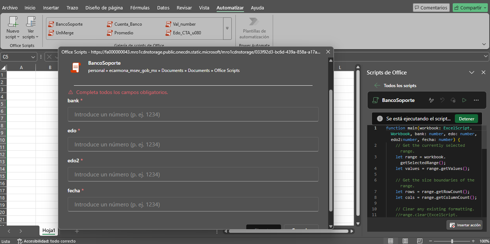

# excel-automation-ts

> Coleccion de Office Scripts en TypeScript para automatizar limpiezas, ajustes y transformaciones frecuentes en libros de Excel.

## El problema

Muchas tareas repetitivas en Excel se hacen manualmente: copiar un rango a varias hojas, borrar columnas que no se necesitan, convertir fechas, ajustar anchos, completar referencias bancarias de ejemplo o transformar calificaciones numericas a texto. Cuando esas acciones se repiten en varios libros, el proceso se vuelve lento y propenso a errores.

Este repositorio esta pensado para personas que trabajan con archivos de Excel y necesitan reutilizar pequenas automatizaciones sin crear una aplicacion completa alrededor del libro.

## La solucion

El proyecto agrupa scripts independientes de Office Scripts. Cada archivo `.osts` contiene una funcion `main` que puede copiarse o importarse en Excel Online y ejecutarse sobre el libro activo.

Flujo general:

1. La persona abre un libro en Excel Online.
2. Selecciona el rango u hoja que necesita procesar.
3. Ejecuta el script correspondiente desde Office Scripts.
4. El script modifica el libro segun la tarea: copiar rangos, limpiar columnas, convertir fechas, ajustar formatos o completar valores de ejemplo.

## Funcionalidades principales

- Asignar identificadores de cuenta de ejemplo segun el banco (`account_number.osts`).
- Generar referencias de soporte de ejemplo por banco y mes (`bank_support.osts`).
- Limpiar apostrofes, mover cargos/abonos y aplicar formato numerico (`charge_credit.osts`).
- Combinar descripciones partidas en filas consecutivas (`combine.osts`).
- Copiar un rango seleccionado a todas las demas hojas del libro (`copy_paste.osts`).
- Convertir cadenas de fecha a formato `MM/DD/YYYY` (`date.osts`).
- Eliminar columnas C a L en las hojas del libro (`del_col.osts`).
- Crear hojas nuevas a partir de nombres seleccionados (`new_sheet.osts`).
- Resaltar una cantidad de celdas aleatorias dentro del rango seleccionado (`random.osts`).
- Convertir calificaciones numericas a palabras en espanol (`school_grades.osts`).
- Autoajustar columnas B, C, D y E en todas las hojas (`width.osts`).

## Que mejora este proyecto

- Reduce tareas manuales repetitivas en Excel.
- Ayuda a aplicar el mismo cambio en varias hojas de forma consistente.
- Evita errores al copiar, limpiar o formatear datos manualmente.
- Sirve como base de ejemplos para adaptar Office Scripts a flujos propios.

## Para quien esta pensado

- Personas que preparan reportes o archivos operativos en Excel.
- Equipos administrativos que limpian y transforman hojas de calculo con frecuencia.
- Usuarios de Excel Online que quieren ejemplos practicos de Office Scripts.
- Desarrolladores o analistas que necesitan plantillas sencillas para automatizar libros.

## Capturas



## Tecnologias utilizadas

- TypeScript: lenguaje usado por Office Scripts.
- Office Scripts: API de automatizacion para Excel Online.
- Excel Online: entorno donde se ejecutan los scripts.

No hay framework web, servidor, base de datos, Docker ni flujo de CI configurado en el estado actual del repositorio.

## Requisitos

- Una cuenta con acceso a Excel Online y Office Scripts.
- Un libro de Excel donde ejecutar los scripts.
- Conocimientos basicos para abrir el editor de Office Scripts y ejecutar una automatizacion.

El repositorio no incluye `package.json`, por lo que no define una version local de Node.js ni un proceso de instalacion con dependencias.

## Instalacion

Clona el repositorio:

```bash
git clone URL_DEL_REPOSITORIO
cd excel-automation-ts
```

Para usar un script en Excel Online:

1. Abre el libro de Excel en el navegador.
2. Entra a la pestana de automatizacion o al editor de Office Scripts.
3. Crea un nuevo script.
4. Copia el contenido del archivo `.osts` que quieras usar.
5. Guarda y ejecuta el script sobre el libro o rango correspondiente.

## Configuracion

Este proyecto no requiere variables de entorno.

Algunos scripts reciben parametros al ejecutarse:

| Script | Parametros | Descripcion |
| --- | --- | --- |
| `account_number.osts` | `bank`, `account` | Indices de columna del banco y de la cuenta dentro del rango seleccionado. |
| `bank_support.osts` | `bank`, `edo`, `edo2`, `fecha` | Indices de columna para banco, columnas destino y fecha. |
| `random.osts` | `n` | Cantidad de celdas aleatorias que se resaltaran dentro del rango seleccionado. |

Los indices usados por los scripts son de base cero. Por ejemplo, la primera columna del rango seleccionado es `0`, la segunda es `1` y asi sucesivamente.

## Base de datos

El proyecto no utiliza base de datos, migraciones ni seeders.

## Ejecutar el proyecto

No existe un servidor local que iniciar. Los scripts se ejecutan dentro de Excel Online.

Ejemplo de uso:

1. Selecciona un rango en el libro.
2. Ejecuta el script desde Office Scripts.
3. Si el script solicita parametros, captura los valores requeridos.
4. Revisa el resultado directamente en la hoja.

## Uso

Elige el script segun la tarea:

- Usa `copy_paste.osts` cuando necesites replicar el mismo rango en todas las hojas.
- Usa `del_col.osts` para limpiar columnas C a L en las hojas del libro.
- Usa `date.osts` para convertir cadenas de fecha al formato esperado.
- Usa `width.osts` para ajustar el ancho de columnas usadas con frecuencia.
- Usa `account_number.osts` y `bank_support.osts` como plantillas; reemplaza los identificadores de ejemplo solo en tu entorno local si necesitas valores reales.

## Estructura

```text
.
+-- README.md              Documentacion del proyecto.
+-- .gitignore             Reglas para evitar subir temporales, secretos y archivos locales.
+-- *.osts                 Scripts independientes para Office Scripts.
```

## Seguridad

- No guardes contrasenas, tokens, claves API ni datos bancarios reales dentro de los scripts.
- Manten valores sensibles en tus libros locales o en sistemas seguros, no en Git.
- Si adaptas `account_number.osts` o `bank_support.osts` con referencias reales, no subas esos cambios a un repositorio publico.
- No publiques archivos `.env`, respaldos, bases de datos locales, claves privadas ni documentos con datos personales.
- Reporta vulnerabilidades de forma responsable mediante un issue privado o el canal que defina la persona mantenedora.

## Pruebas

Actualmente no hay suite automatizada de pruebas ni configuracion local de compilacion. La validacion se realiza ejecutando cada script en Excel Online con un libro de prueba.

## Estado del proyecto

El proyecto es una coleccion inicial de scripts utilitarios. Los scripts son independientes entre si y estan pensados como ejemplos adaptables, no como una libreria empaquetada.

## Limitaciones actuales

- No existe una suite automatizada para validar los scripts fuera de Excel Online.
- No hay archivos de ejemplo con datos ficticios para demostrar cada caso.
- Algunos scripts asumen estructuras concretas de columnas o formatos de fecha.
- `school_grades.osts` escribe el resultado en `B1:B10`, por lo que esta pensado para rangos pequenos y puede requerir ajuste si se selecciona otra cantidad de filas.
- Los scripts no incluyen manejo avanzado de errores para todos los formatos de datos posibles.

## Proximas mejoras

- Agregar libros o tablas de ejemplo con datos ficticios.
- Documentar entradas y salidas esperadas por cada script.
- Anadir validaciones para formatos de fecha, rangos vacios y columnas faltantes.
- Crear pruebas o comprobaciones locales si se incorpora tooling de TypeScript para Office Scripts.
- Separar scripts de ejemplo de scripts adaptados a flujos reales.

## Contribuciones

1. Haz un fork del repositorio.
2. Crea una rama para tu cambio:

```bash
git checkout -b feature/nueva-automatizacion
```

3. Agrega o mejora scripts con datos de ejemplo, nunca con datos reales.
4. Documenta el caso de uso en este README.
5. Prueba el script en Excel Online con un libro ficticio.
6. Abre un Pull Request describiendo que problema resuelve.

## Licencia

Este proyecto todavia no incluye un archivo de licencia.
